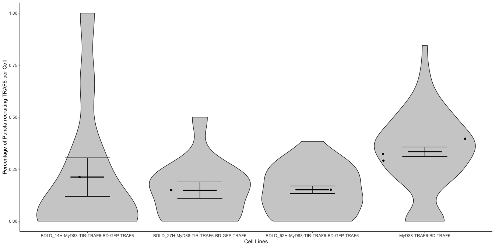
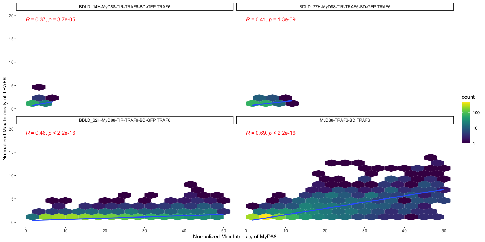
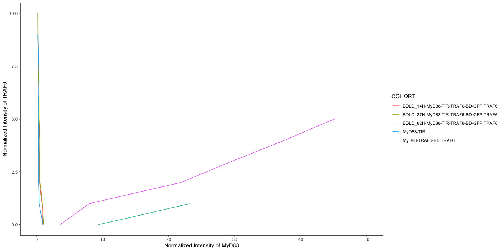
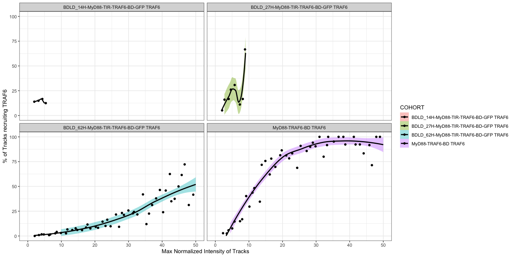
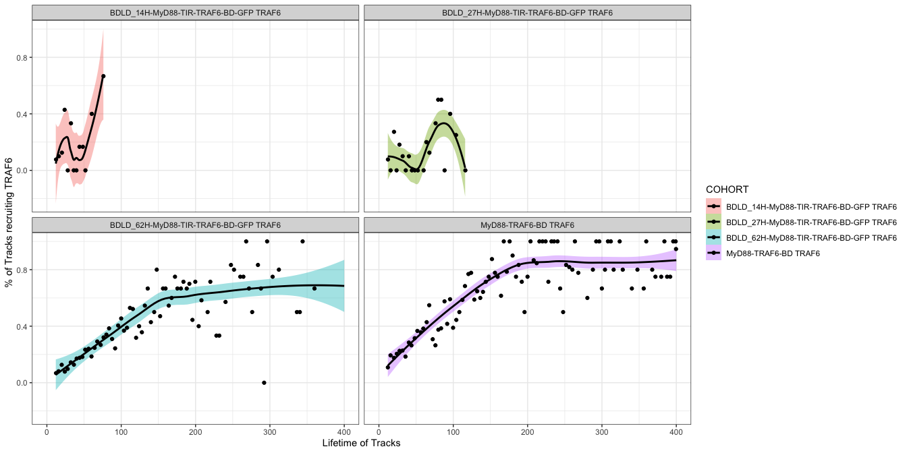
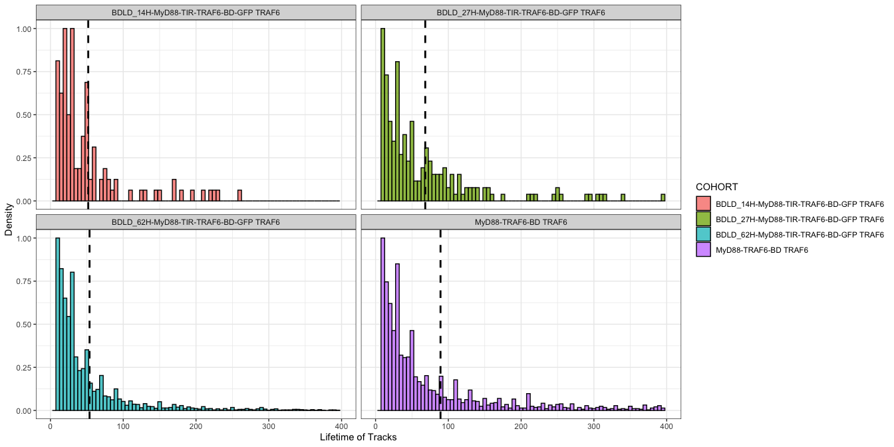

LCI_Analysis
================
Finn Lobnow
, Last edited on 05 June 2023

- <a href="#cell-lines" id="toc-cell-lines">CELL LINES</a>
- <a href="#parameters" id="toc-parameters">PARAMETERS</a>
  - <a
    href="#plot-the-percentage-of-tracks-recruiting-traf6-per-cell-as-a-violin"
    id="toc-plot-the-percentage-of-tracks-recruiting-traf6-per-cell-as-a-violin">Plot
    the percentage of tracks recruiting TRAF6 per cell as a violin</a>
  - <a href="#plot-the-myd88-intensity-over-traf6-intensity-using-geom_hex"
    id="toc-plot-the-myd88-intensity-over-traf6-intensity-using-geom_hex">Plot
    the MyD88 intensity over TRAF6 intensity using geom_hex</a>
  - <a href="#plot-the-myd88-intensity-over-traf6-intensity-using-geom_path"
    id="toc-plot-the-myd88-intensity-over-traf6-intensity-using-geom_path">Plot
    the MyD88 intensity over TRAF6 intensity using geom_path</a>
  - <a
    href="#percentage-of-puncta-at-distinct-size-lifetime-to-recruit-traf6"
    id="toc-percentage-of-puncta-at-distinct-size-lifetime-to-recruit-traf6">Percentage
    of puncta at distinct size/ Lifetime to recruit TRAF6</a>
  - <a href="#percentagw-of-traf6-at-different-max-normalized-intensities"
    id="toc-percentagw-of-traf6-at-different-max-normalized-intensities">Percentagw
    of TRAF6 at different Max normalized Intensities</a>
  - <a
    href="#plot-the-percentage-of-traf6-recruitement-at-different-lifetimes"
    id="toc-plot-the-percentage-of-traf6-recruitement-at-different-lifetimes">Plot
    the percentage of TRAF6 recruitement at different Lifetimes</a>

## CELL LINES

- BDLD_27H-MyD88-TIR-TRAF6-BD-GFP TRAF6
- BDLD_50H-MyD88-TIR-TRAF6-BD-GFP TRAF6
- BDLD_14H-MyD88-TIR-TRAF6-BD-GFP TRAF6
- BDLD_62H-MyD88-TIR-TRAF6-BD-GFP TRAF6
- BDLD_57H-MyD88-TIR-TRAF6-BD-GFP TRAF6
- BDLD_13H-MyD88-TIR-TRAF6-BD-GFP TRAF6
- BDLD_10H-MyD88-TIR-TRAF6-BD-GFP TRAF6
- 3E10

## PARAMETERS

### Plot the percentage of tracks recruiting TRAF6 per cell as a violin

Percentage of Spots above threshold Lifetime/ Max Intensity per Cell per
Cell line

<!-- -->

### Plot the MyD88 intensity over TRAF6 intensity using geom_hex

<!-- -->

### Plot the MyD88 intensity over TRAF6 intensity using geom_path

<!-- -->

### Percentage of puncta at distinct size/ Lifetime to recruit TRAF6

| COHORT                                | MAX_NORMALIZED_INTENSITY | LIFETIME |
|:--------------------------------------|-------------------------:|---------:|
| BDLD_14H-MyD88-TIR-TRAF6-BD-GFP TRAF6 |                 2.957265 | 51.93162 |
| BDLD_27H-MyD88-TIR-TRAF6-BD-GFP TRAF6 |                 3.790244 | 68.25854 |
| BDLD_62H-MyD88-TIR-TRAF6-BD-GFP TRAF6 |                27.482719 | 53.73138 |
| MyD88-TRAF6-BD TRAF6                  |                19.306317 | 89.23361 |

### Percentagw of TRAF6 at different Max normalized Intensities

<!-- -->

### Plot the percentage of TRAF6 recruitement at different Lifetimes

<!-- --><!-- -->
